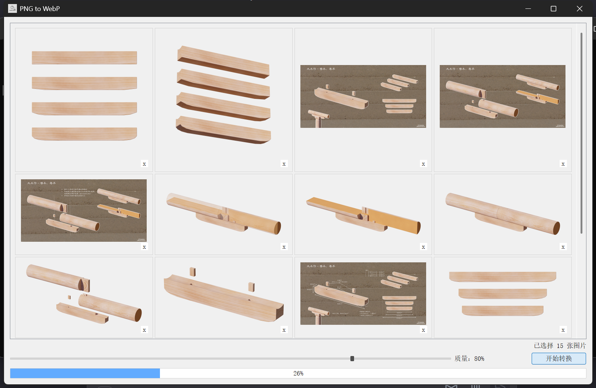
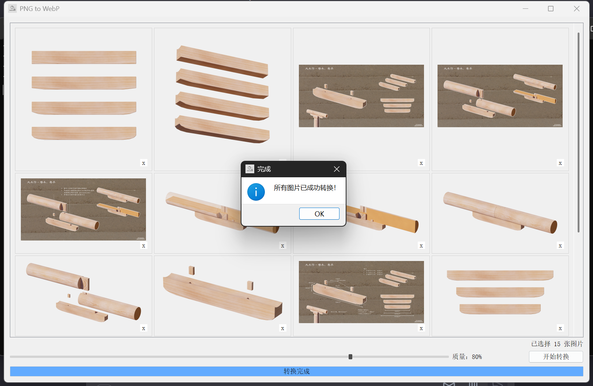

# png2webp
这是一个将png图片转换为webp格式图片的python脚本。This is a Python script that converts PNG images to WebP format images.

我是一个编程小白，这个脚本主要是使用[Kimi AI](kimi.ai)工具完成，***我几乎没有进行一行编码***，只是调整了提示文本和部分样式。
感谢AI工具让我这种编程小白也能通过对话，花费少量精力就能制作一些实用小工具。
这个工具是我用来优化我个人网站图片的，这是我的个人网站：[月石Moonstone](www.moonstone.fun)，一个通过插图和3D模型展示中国古建筑相关知识和内容的网站。

工具依赖：
- pyqt5
- pillow
(.bat只是一个启动器)

